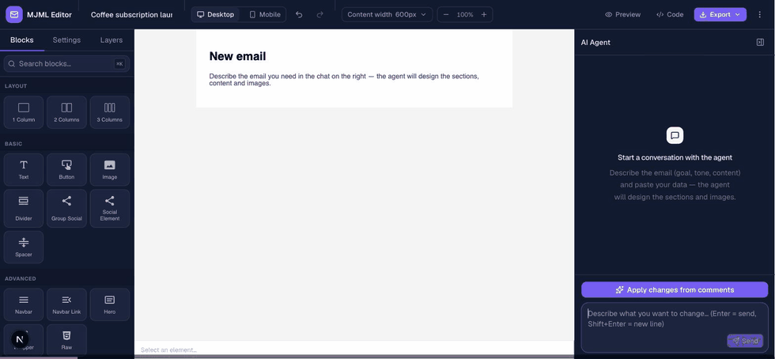

# MJML Agent Editor

[](https://github.com/KrzysztofMarmol/mjml-agent-editor/actions/workflows/ci.yml)

A React editor for [MJML](https://mjml.io/) emails with an AI assistant for drafting and
editing. Use the visual canvas, ask for changes in chat, or leave comments on individual
elements for the assistant to address.

This repository contains reusable packages and a Next.js example application backed by
Supabase.



## Features

- Edit email layouts, text, and styles on a GrapesJS canvas with MJML components.
- Generate a draft or update individual sections through chat.
- Pin comments to elements and ask the assistant to apply the requested changes.
- Preview desktop and mobile layouts and export MJML or compiled HTML.
- Validate the assistant's MJML changes before saving; return compiler errors to the model
  so it can retry.

The example uses placeholder images. Image generation requires an `ImageProvider`
implementation supplied by the host application.

## Run the example locally

### Requirements

- Node.js 22 (the version used in CI).
- pnpm 11.6.0, as pinned in `package.json`.
- Docker running, for local Supabase.
- An API key for the selected model provider. The default is Anthropic.

### 1. Install dependencies

```sh
git clone https://github.com/KrzysztofMarmol/mjml-agent-editor.git
cd mjml-agent-editor
pnpm install --frozen-lockfile
```

Run the following commands from the repository root.

### 2. Start Supabase

```sh
npx supabase start
npx supabase status
```

Supabase starts the local database and applies the migrations in `supabase/migrations`.
Keep the keys printed by `supabase status` for the next step.

### 3. Configure the application

```sh
cp apps/example/.env.example apps/example/.env.local
```

Fill in these values in `apps/example/.env.local`:

| Variable                        | Value                             |
| ------------------------------- | --------------------------------- |
| `SUPABASE_SERVICE_ROLE_KEY`     | Local Supabase `service_role` key |
| `NEXT_PUBLIC_SUPABASE_ANON_KEY` | Local Supabase `anon` key         |
| `ANTHROPIC_API_KEY`             | Your Anthropic API key            |

The Supabase URLs in the template already point to the local instance. Keep the service-role
key on the server; only the anon key belongs in a `NEXT_PUBLIC_*` variable.

To use DeepSeek, Gemini, or a custom OpenAI-compatible endpoint, set `AGENT_PROVIDER` and
the matching key and model in the same file. See the
[backend configuration guide](packages/agent-node/README.md#choosing-a-backend).

### 4. Build and start

```sh
pnpm build
pnpm --filter @mjml-agent-editor/example dev
```

Open [localhost:3000](http://localhost:3000), create an email, and try a prompt such as
“Write a welcome email with a heading, a short introduction, and a call-to-action button.”

The example has no authentication or authorization, and its database grants anonymous
users full access to documents and comments. Before deploying it publicly, add access
controls and limits on model usage. See [known issues](docs/known-issues.md) and
[agent backend configuration](packages/agent-node/README.md#before-putting-this-on-the-internet).

## Use the packages in your application

For an existing React 19 application, install the editor and TypeScript agent backend:

```sh
npm install @mjml-agent-editor/editor @mjml-agent-editor/agent-node
```

The editor and agent use `DocumentStore` and `CommentStore` interfaces for persistence.
Supply your own implementations or use `@mjml-agent-editor/store-supabase`. The editor
supports CSS theme variables and label overrides.

Start with the [editor integration guide](packages/editor/README.md) for the store provider,
stylesheets, and loading the canvas in a browser. The
[agent backend guide](packages/agent-node/README.md) shows how to mount the chat handler
and configure its model, authorization, and conversation storage.

| Package                                                                  | Purpose                                                                      |
| ------------------------------------------------------------------------ | ---------------------------------------------------------------------------- |
| [`@mjml-agent-editor/editor`](packages/editor/README.md)                 | React canvas, chat panel, comments, and export controls                      |
| [`@mjml-agent-editor/agent-node`](packages/agent-node/README.md)         | TypeScript agent backend using the Vercel AI SDK                             |
| [`@mjml-agent-editor/core`](packages/agent-core/README.md)               | Tool schemas, system prompt, MJML section addressing, and storage interfaces |
| [`@mjml-agent-editor/store-supabase`](packages/store-supabase/README.md) | Supabase storage adapters and a placeholder image provider                   |

## Other backends

The [agent contract](docs/agent-contract.md) defines the tools and streaming protocol an
editor-compatible backend must implement. The included [Python backend](agent-python/README.md)
reads its tool definitions and system prompt from `packages/agent-core/contract/tools.json`,
generated from the same definitions the TypeScript backend uses.

The [conformance suite](packages/conformance/README.md) checks backend behavior against a
running endpoint.

## Contributing and support

See [CONTRIBUTING.md](CONTRIBUTING.md) for development setup, checks, and pull request
guidelines, and [known issues](docs/known-issues.md) for current limitations.

Report bugs and request features in
[GitHub Issues](https://github.com/KrzysztofMarmol/mjml-agent-editor/issues). Include steps
to reproduce and your environment when reporting a bug.

Maintained by [Krzysztof Marmol](https://github.com/KrzysztofMarmol).

## License

[MIT](LICENSE).
